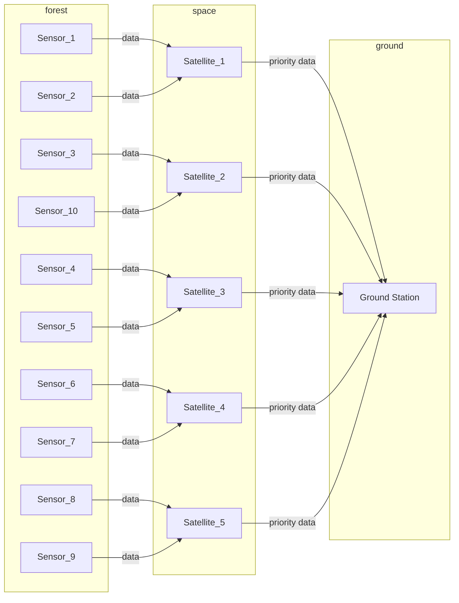

# **Scalable Usecase System (Group 4)**

## **Overview**
The Scalable Usecase System simulates a forest fire monitoring system with the following components:
- **Sensors**: Collect environmental data (e.g., temperature, smoke level) and send it to satellites.
- **Satellites**: Relay data from sensors to a ground station, broadcast data to other satellites, and prioritize critical data.
- **Ground Station**: Processes and stores received data locally, triggers alerts for fire detection.

This project is built using Python and employs RSA encryption for secure message transfer.

---

## **Project Structure**

```plaintext
Scalable_usecase_group_4/
├── README.md                      # Project documentation
├── components/
│   ├── groundstation/
│   │   └── ground_station.py      # Ground station logic
│   ├── satellites/
│   │   └── satellite.py           # Satellite logic
│   └── sensors/
│       └── sensor.py              # Sensor logic
├── protocol/
│   ├── crypto/
│   │   ├── private_key.pem        # RSA private key
│   │   └── public_key.pem         # RSA public key
│   ├── discovery/
│   │   └── adjacency_list.json    # Adjacency list for routing
│   └── jarvis.py                  # Core protocol implementation
├── run_sensor.py                  # Run the sensor component
├── run_satellite.py               # Run the satellite component
├── run_ground_station.py          # Run the ground station component
├── run.sh                         # Orchestrates running all components
├── generate_keys.py               # Script to generate RSA keys
```

---
### Component


## **Setup**

### 1. **Install Dependencies**
This project requires Python 3. Install the dependencies:
```bash
pip install cryptography
```

### 2. **Generate RSA Keys**
Run the `generate_keys.py` script to generate RSA key files:
```bash
python3 generate_keys.py
```
The keys will be saved in the `protocol/crypto/` directory:
- `private_key.pem`
- `public_key.pem`

### 3. **Verify Adjacency List**
Ensure the `protocol/discovery/adjacency_list.json` contains valid JSON:
```json
{
    "S1": {"LEO1": 1},
    "S2": {"LEO1": 1},
    "LEO1": {"GS": 1},
    "LEO2": {"GS": 1}
}
```

---

## **Running the System**

### 1. **Run All Components**
Use the `run.sh` script to start all components:
```bash
./run.sh
```

### 2. **Run Components Individually**
You can run each component separately for debugging or testing:
- **Sensor**:
    ```bash
    python3 run_sensor.py
    ```
- **Satellite**:
    ```bash
    python3 run_satellite.py
    ```
- **Ground Station**:
    ```bash
    python3 run_ground_station.py
    ```

---

## **Features**
1. **Secure Communication**:
   - Messages are encrypted using RSA.
   - Integrity is verified using CRC32 checksums.

2. **Routing and Relaying**:
   - Sensors send data to linked satellites.
   - Satellites broadcast to other satellites and relay to the ground station.

3. **Fire Detection**:
   - Alerts are triggered if thresholds for temperature or smoke levels are exceeded.

4. **Data Storage**:
   - The ground station stores all received data locally in JSON format.

---

## **Future Enhancements**
1. **Dynamic Routing**: Implement adaptive routing based on network conditions.
2. **Fault Tolerance**: Add retry mechanisms for failed transmissions.
3. **Dashboard**: Develop a web-based interface to visualize data and alerts.

---

